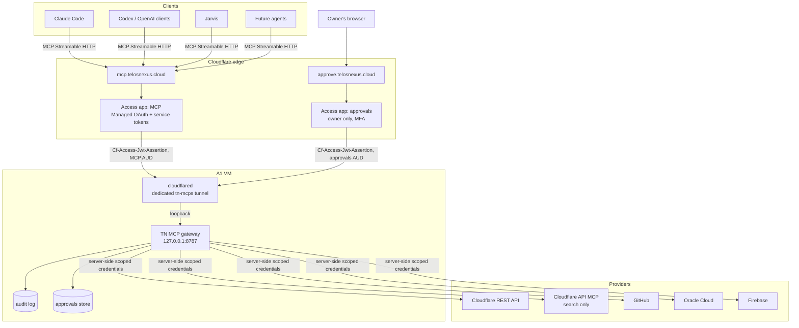

# Architecture

TN-MCPs is the **Telos Nexus MCP control plane**: one authenticated MCP endpoint
(`https://mcp.telosnexus.cloud/mcp`) that gives AI clients (Claude Code, Codex/OpenAI,
Jarvis, future agents) policy-checked, audited, approval-gated access to Telos Nexus
infrastructure providers: Cloudflare first, then GitHub, Oracle Cloud, Firebase, and
internal Telos systems.

It is **not** a re-implementation of provider APIs. It is a thin, strict layer that
decides *who* may do *what*, records *that they did*, and stops *irreversible* actions
until a human says yes through a channel the AI can't reach.

Status: Phase 1 (repository foundation). Nothing below Phase 1 exists in code yet.
[MASTER_PLAN.md](MASTER_PLAN.md) sequences it and holds the binding contracts (§A.7).
Last verified 2026-09-15.

---

## 1. System context



No inbound port is opened on the VM. `cloudflared` makes outbound-only connections, and
the gateway listens on loopback only.

## 2. Request path, end to end

1. The client POSTs a JSON-RPC request to `https://mcp.telosnexus.cloud/mcp`.
2. **Cloudflare Access** authenticates the caller before anything reaches the VM:
   - humans: OAuth 2.0 authorization-code flow with **Managed OAuth** (Access is the
     authorization server; the client holds an opaque `oauth:…` token);
   - machines (Jarvis, automation): **Access service tokens** under a *Service Auth*
     policy.
   Unauthenticated requests get `401` + `WWW-Authenticate` at the edge.
3. Access forwards the request through the tunnel with a signed
   `Cf-Access-Jwt-Assertion`.
4. The **gateway** verifies that JWT itself and maps it to a **Principal** (§4). A
   request without a valid assertion is rejected even on loopback, because a tunnel
   forwards to loopback and so do local processes.
5. Transport checks: `Host`/`Origin` validation, `MCP-Protocol-Version`, and header/body
   match rules (the official SDK does the protocol checks).
6. For `tools/call`, the **policy wrapper** runs before the provider handler:
   authorize → evaluate policy on the call's resources → check approval and
   precondition → audit intent → execute → audit outcome → enforce the result-size cap.
7. The provider adapter calls the upstream API with **its own scoped credential**. The
   inbound credential never reaches provider code (MCP forbids token passthrough).

## 3. Protocol layer

| Decision | Choice | Why |
| --- | --- | --- |
| Spec revision | **2026-07-28**, served **dual-era** | Claude Code's v2 runtime negotiates 2026-07-28; its v1 runtime and many other clients still send the 2025-11-25 `initialize` handshake, and legacy clients have no way to step up. |
| SDK | Official TS SDK **v2**: `@modelcontextprotocol/server` 2.0.0 + `@modelcontextprotocol/node` 2.0.0 | Implements 2026-07-28; `createMcpHandler` serves both eras from one endpoint (default `legacy: 'stateless'`). v1 is on maintenance only. |
| Transport | Streamable HTTP, single `POST /mcp` | GET/DELETE → `405`; `Mcp-Session-Id` ignored (2026-07-28 behavior). |
| State | Stateless, with a per-request `McpServer` factory | No protocol sessions in 2026-07-28. Cross-call state (approvals) uses server-minted IDs bound to the principal, never treated as authentication. |
| Response shape | JSON by default; SSE only for progress | Simple through the tunnel; `X-Accel-Buffering: no` on SSE. |
| Deprecated features | Not implemented: Sampling, Roots, Logging, HTTP+SSE | Deprecated in 2026-07-28. Logs go to journald. |
| Human approval | Out-of-band approvals app, **not** elicitation/MRTR | An in-band prompt goes to the same client that made the request, so it proves nothing. |

Tool naming: `<provider>_<verb>_<object>`, ASCII snake_case (fits `Mcp-Name` without
Base64). `tools/list` is sorted. Results are capped at 48 KiB with an explicit cursor and
`truncated` flag (MASTER_PLAN A.7).

## 4. Identity and authorization

The gateway verifies `Cf-Access-Jwt-Assertion` with `jose`: RS256 only; `iss` = the team
domain; `aud` (an array) contains the expected AUD; `exp`/`iat` valid; `type === 'app'`.
JWKS from `https://<team>.cloudflareaccess.com/cdn-cgi/access/certs`, cached, refreshed on
unknown `kid`.

**Principal contract.** Anything that doesn't match is rejected:

| Principal | Required claim shape | ID |
| --- | --- | --- |
| human | `email` present, `sub` non-empty, no `common_name`; lowercased email on `TN_ALLOWED_EMAILS` | `sub` |
| service | `common_name` non-empty, `sub === ''`, no `email`; `common_name` on `TN_ALLOWED_SERVICE_TOKEN_IDS` | `svc:<common_name>` |

(Claim shapes per Cloudflare's application-token reference; re-confirmed by the Phase 4
spike.)

- Roles (`viewer`, `operator`, `admin`) come from server-side configuration. An unlisted
  identity is denied, not defaulted. Access policies decide who reaches the gateway; the
  gateway decides what they may do.
- Scopes are per tool (`cloudflare:read`, `cloudflare:dns:write`, …). A missing scope
  returns a tool error naming it.
- Behind Access Managed OAuth the gateway issues no tokens and sends **no** OAuth
  challenges of its own, because Cloudflare documents that combination as incompatible.
  Access serves the discovery documents (Phase 4 confirms which ones: MASTER_PLAN S8).
- **Two Access applications, two audiences:** the MCP app (`mcp.telosnexus.cloud`) and
  the approvals app (`approve.telosnexus.cloud`, owner-only, MFA, short session). The
  gateway accepts approval decisions only with the approvals AUD. A token obtained by an
  MCP client can't approve anything (B12).
- **Local development:** `TN_AUTH_MODE=dev` (static token) is refused unless
  `NODE_ENV=development` and there is no public URL. Loopback binding alone isn't
  isolation, because the tunnel forwards to loopback (B7).
- **Fallback** if Managed OAuth fails for a required client (Phase 4): a Cloudflare MCP
  server portal in front of the gateway, authenticating to it with a service token. The
  gateway's policy stays authoritative.

## 5. Policy, risk, and the tool contract

Every tool from every provider is declared through one contract (full type in
MASTER_PLAN A.7): `name`, `provider`, `risk` (`read` | `write` | `destructive`), `scopes`,
`approval` (`never` | `policy` | `always`), zod `input`, MCP `annotations`, optional
`resources(args)` (what it touches, e.g. a zone marked `production`), optional
`precondition(args)` (a hash of the current state for TOCTOU protection), and `handler`.

| Class | Examples | Default gate |
| --- | --- | --- |
| `read` | list zones, get DNS records, list tunnels | scope + audit |
| `write` | upsert one DNS record, deploy Pages, update a tunnel route | scope + audit + approval per policy (always for `production` resources) |
| `destructive` | delete zone, change nameservers, delete R2 bucket/Worker, destroy tunnel, bulk DNS delete | scope + audit + single-use human approval, **always** |

**Enforcement, strongest first:**

1. **Dependency graph:** only `servers/gateway` depends on the MCP server SDK (B1).
2. **Single call site:** only `servers/gateway/src/policy-wrapper.ts` may call SDK
   registration functions, and `scripts/check-boundaries.mjs` enforces it (B2).
3. **Types and credentials:** read tools get a GET-only provider client and a read-only
   token (B3); write tokens are injected only into write/destructive definitions.
4. **Tests:** registry invariants (destructive ⇒ `always`; annotations match risk; no
   tool defines its own `approval_id`); binding and precondition tests (B4).

## 6. Approvals

1. A gated call returns a tool error with
   `{ status: 'approval_required', approvalId, expiresAt, summary }`. Nothing executes.
2. The owner opens the approvals app (`approve.telosnexus.cloud`), which has its own
   Access application with owner-only policy, IdP MFA, and a session of 10 minutes or
   less. The page shows the requester, the tool, the **full semantic arguments**, the
   precondition diff, and the policy reason. The owner approves or denies.
3. The approval binds principal + tool + RFC 8785-canonical args hash (excluding
   `approval_id`) + precondition hash + policy version + gateway release + expiry
   (15 min). It is **single-use**.
4. The client repeats the call with the reserved `approval_id` argument. The gateway
   re-verifies the binding, **re-runs the precondition** (refusing if state changed),
   moves the approval to `executing` in a transaction, executes, and marks it
   `consumed`. A crash in between yields `unknown_outcome`: an alert, never an automatic
   retry.

The local CLI (`tn-mcps approvals list|show|deny`) works everywhere, and `approve` only
outside production. Every step is audited. MASTER_PLAN A.7 holds the exact state machine.

**Residual risk (B13):** AI agent CLIs on the VM currently run as `ubuntu`, which has
passwordless sudo. Root can read any provider token and bypass every local control.
TN-MCPs can't defend against that. The owner's decision Q11 (non-sudo agent user)
must be applied before write-capable credentials exist on the VM.

## 7. Audit

- JSON Lines (RFC 8785 canonical) under `/var/lib/tn-mcps/audit/`, daily files. The
  hash chain continues across files, and each record carries `keyId` and an HMAC (key
  file readable only by the gateway user) for tamper evidence (`tn-mcps audit verify`).
- Records hold principal, client info, tool, risk, **redacted** arguments, decision,
  approval ID, outcome, duration, and upstream request IDs.
- The intent record is written **before** execution. If it can't be written, the call
  is refused.
- Phase 8 ships records off-box (≤ 15 min lag) to a dedicated R2 bucket with a
  write-only credential. Restores use a read-only credential held off the VM.

## 8. Providers

### Cloudflare (first provider)

| Adapter | Used for | Credential |
| --- | --- | --- |
| **Curated tools** via the official `cloudflare` TypeScript SDK (v7.x) over a GET-only client | `cloudflare_account_overview`, `cloudflare_list_zones`, `cloudflare_get_dns_records`, `cloudflare_get_pages_projects`, `cloudflare_get_workers`, `cloudflare_get_tunnels`, `cloudflare_get_r2_buckets`; the Phase 9 writes use a separate write client | Token A (read, IP-filtered); Token C (write, Phase 9 only) |
| **Upstream Cloudflare API MCP** (`https://mcp.cloudflare.com/mcp`) | `cloudflare_api_search` only: search the OpenAPI spec to find endpoints. Upstream `execute` (arbitrary model-written code that can mutate) is **not** proxied | Token B (read, no IP filter because upstream doesn't support it) |

Why: the policy layer can classify a curated tool with fixed endpoints, but it can't
classify arbitrary JavaScript. Proxying `search` still uses Cloudflare's official
MCP for API discovery. Relying on a token's permissions alone to make `execute`
read-only would make the boundary depend on dashboard configuration staying correct.
Details: [CLOUDFLARE.md](CLOUDFLARE.md).

### Later providers

GitHub (GitHub App installation tokens), Oracle Cloud (least-privilege IAM user),
Firebase (minimal-role service account), Telos internal (service-to-service tokens).
Same contract: curated tools, per-risk credentials, no passthrough. Official upstream
MCP servers are proxied only for tools that are read-only by construction.

## 9. Repository layout

Created by the phase that needs each directory, never earlier.

```
TN-MCPs/
├── packages/
│   ├── shared/        Phase 1  redaction, typed config loading
│   ├── core/          Phase 2  tool contract, registry, principal/ctx types, secret-file rule
│   ├── policy/        Phase 3  risk classes, policy engine, rate limits
│   ├── audit/         Phase 3  hash-chained JSONL audit writer + verifier
│   ├── approvals/     Phase 3  approval store (node:sqlite) + CLI
│   └── auth/          Phase 4  Access JWT verifier, principal mapping
├── providers/
│   ├── cloudflare/    Phase 5
│   ├── github/        Phase 10
│   ├── oracle/        Phase 11
│   ├── firebase/      Phase 12
│   └── telos/         Phase 13
├── servers/
│   └── gateway/       Phase 2  the only MCP server; composes providers through policy
├── deploy/            Phase 6  systemd units, cloudflared notes, preflight/deploy/rollback
├── scripts/           Phase 1  guard-secrets.mjs; Phase 2 check-boundaries.mjs
├── docs/
└── .github/           Phase 1  CI (GitHub-hosted runners only), Dependabot
```

**Why one gateway rather than one MCP server per provider** (a change from the
original concept, where each provider lived under `servers/`): one endpoint means one
Access application, one OAuth resource, one tunnel hostname, one audit stream, and one
policy chokepoint. Per-provider servers would each need all of that, and each duplicate
is another place to get security wrong. If the tool count grows too large, the same
gateway can expose per-provider paths (`/cloudflare/mcp`) while sharing the chokepoint.

## 10. Runtime topology on the A1 VM

- Node.js 24 LTS. The gateway runs as a **native systemd service** under the
  unprivileged user `tnmcp`, bound to `127.0.0.1:8787`, sandboxed (`ProtectSystem=strict`,
  `NoNewPrivileges`, `PrivateTmp`, `MemoryMax=512M`).
- A **dedicated remotely-managed Cloudflare Tunnel** (`tn-mcps`) under its own user
  `tnmcp-tunnel`. The gateway user can't read the tunnel token, and vice versa. The
  existing Telos Nexus tunnel isn't touched.
- Docker is not installed and isn't introduced. One Node process doesn't need it;
  Docker's iptables management would interfere with the host's existing iptables/LXD
  rules and can publish ports around them; and RAM is under pressure (swap fully used
  on 2026-09-15).
- Deployment is pull-based and verifies that the commit is on `main` with a successful
  push-triggered CI run, then runs the full gate on the VM before switching
  ([DEPLOYMENT_A1.md](DEPLOYMENT_A1.md) §4).

## 11. Verified vs assumed

MASTER_PLAN §A.2 holds the authoritative list, with each assumption's test and phase. In
short: the protocol, SDK, Claude Code runtime, Access Managed OAuth, and Cloudflare API
MCP behavior were verified from primary sources on 2026-09-15. The main open
assumptions are that Claude Code completes Managed OAuth against our own Access app (S1),
which well-known documents Access serves (S8), and session lifetime (S9). The Phase 4
spike tests all three before any gateway exposure.

## Sources

- MCP: https://modelcontextprotocol.io/specification/versioning ·
  https://modelcontextprotocol.io/specification/2026-07-28/changelog ·
  https://modelcontextprotocol.io/specification/2026-07-28/basic/transports/streamable-http ·
  https://modelcontextprotocol.io/specification/2026-07-28/basic/authorization ·
  https://modelcontextprotocol.io/docs/2026-07-28/tutorials/security/security_best_practices
- TS SDK v2: https://github.com/modelcontextprotocol/typescript-sdk (docs/serving/http.md,
  docs/serving/authorization.md, docs/protocol-versions.md, packages/middleware/node)
- Claude Code MCP: https://code.claude.com/docs/en/mcp
- Cloudflare: https://developers.cloudflare.com/agents/model-context-protocol/mcp-servers-for-cloudflare/ ·
  https://developers.cloudflare.com/cloudflare-one/access-controls/applications/http-apps/managed-oauth/ ·
  https://developers.cloudflare.com/cloudflare-one/access-controls/ai-controls/mcp-portals/ ·
  https://developers.cloudflare.com/cloudflare-one/access-controls/applications/http-apps/authorization-cookie/validating-json/ ·
  https://developers.cloudflare.com/cloudflare-one/access-controls/applications/http-apps/authorization-cookie/application-token/ ·
  https://github.com/cloudflare/mcp
- JSON Canonicalization Scheme: https://www.rfc-editor.org/rfc/rfc8785
