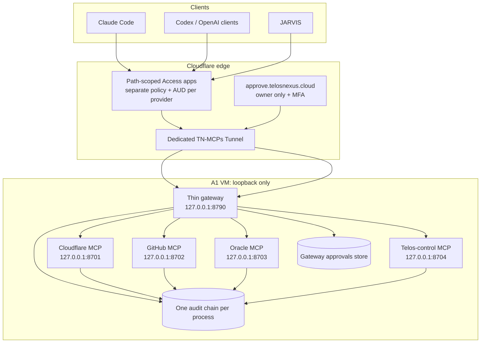

# Architecture

TN-MCPs is the Telos Nexus multi-MCP control plane: separate provider MCP server
processes behind a thin gateway. Clients use path-specific endpoints under
`https://mcp.telosnexus.cloud`; every call is authenticated, policy-checked, audited,
and approval-gated according to risk.

Status: Phase 1 (repository foundation). Nothing below Phase 1 exists in code yet.
[TN_MCPS_MASTER_IMPLEMENTATION_PLAN.md](TN_MCPS_MASTER_IMPLEMENTATION_PLAN.md) is the
owner's architecture/security contract. [MASTER_PLAN.md](MASTER_PLAN.md) revision 3 is
the phased execution plan and holds the binding contracts (§A.7). Last verified
2026-09-15.

## 1. System context



No TN-MCPs origin port is public. The tunnel publishes only the gateway. The gateway
holds no provider credentials; each backend runs under a distinct Unix identity and
can read only its own provider secrets.

## 2. Public endpoints and request path

| Server | Public resource URI | Loopback | Unit | User |
| --- | --- | --- | --- | --- |
| Cloudflare | `https://mcp.telosnexus.cloud/cloudflare/mcp` | `127.0.0.1:8701` | `tn-mcp-cloudflare.service` | `tnmcp-cloudflare` |
| GitHub | `https://mcp.telosnexus.cloud/github/mcp` | `127.0.0.1:8702` | `tn-mcp-github.service` | `tnmcp-github` |
| Oracle | `https://mcp.telosnexus.cloud/oracle/mcp` | `127.0.0.1:8703` | `tn-mcp-oracle.service` | `tnmcp-oracle` |
| Telos control | `https://mcp.telosnexus.cloud/telos/mcp` | `127.0.0.1:8704` | `tn-mcp-telos.service` | `tnmcp-telos` |

The canonical OAuth resource URI includes the full path. Ports are typed central
configuration in `packages/config`; 8790 and 8701–8704 were verified free on
2026-09-15.

Request flow:

1. A client POSTs to one canonical path. Its path-scoped Access application
   authenticates it and attaches `Cf-Access-Jwt-Assertion`.
2. The gateway validates Host/Origin, enforces the 1 MiB body limit, injects or
   validates `X-Request-Id`, rate-limits per principal, and verifies the JWT against
   the route's AUD before proxying.
3. The gateway removes `Authorization` and `Cookie`, forwards the Access assertion,
   and routes to the configured loopback backend. `GET /healthz` needs no auth and
   reveals no internals.
4. The MCP server independently verifies the assertion against its own expected AUD,
   then mcp-common's wrapper performs scope/policy/approval checks, writes audit intent,
   executes with that server's credential, writes outcome, and enforces result limits.

A later authenticated registry may list enabled servers, paths, and non-sensitive
capabilities. It must never reveal credentials or sensitive infrastructure metadata.

## 3. Why separate MCP processes

The owner's model wins because it provides credential and blast-radius isolation,
per-provider Access policies/scopes, and independent server evolution. Compromise of
the GitHub process cannot read Cloudflare tokens. Shared packages retain one
implementation of server creation, auth, policy, audit, approval clients, typed config,
and observability, avoiding policy drift without merging security principals.

Revision 2 chose one credential-bearing gateway process to obtain one endpoint, one
Access application, one audit writer, and one policy chokepoint. That rationale is
superseded: stable routing still comes from the thin gateway; mcp-common remains the
single registration/policy chokepoint; per-process audit chains avoid unsafe concurrent
writers; separate Access apps and Unix users provide the isolation required by the
contract.

## 4. Gateway and shared-package boundaries

The gateway is an edge router, not an MCP implementation or provider adapter. It owns
the approvals database and, in Phase 8, the approvals web app. MCP servers create,
check, and consume approvals over `/run/tn-mcps/gateway.sock`. The gateway authenticates
the caller from Unix peer credentials (`SO_PEERCRED` UID); Phase 3 fixes the schema,
socket modes, timeouts, replay handling, and failure behavior. The gateway is the sole
store writer.

Two structural rules prevent bypass:

1. Only `packages/mcp-common` imports `@modelcontextprotocol/server` (B1).
2. Only `packages/mcp-common/src/policy-wrapper.ts` calls SDK registration functions
   (B2). Each `mcps/*` process uses `createTelosMcpServer({ name, tools })`.

`scripts/check-boundaries.mjs` enforces both; registry tests prove every exposed tool
has a matching policy definition.

Shared packages are `shared` (redaction and `loadConfig`), `mcp-common`, `auth`,
`policy`, `audit`, `approvals`, `config`, and `observability` (structured logger,
request IDs, metrics). Sharing code never grants one process access to another
process's secret directory.

## 5. Protocol layer

| Decision | Choice |
| --- | --- |
| Spec | MCP 2026-07-28, served dual-era for 2025-11-25 clients |
| SDK | Official TS SDK v2, isolated in `packages/mcp-common` |
| Transport | Streamable HTTP; canonical endpoint ends in `/mcp` |
| State | Stateless protocol requests; approvals are server state, never authentication |
| Responses | JSON by default; SSE only for progress, with buffering disabled |
| Deprecated features | No Sampling, Roots, protocol Logging, or old HTTP+SSE transport |
| Human approval | Out-of-band approvals app, never an in-band model prompt |

Tools use short ASCII snake_case provider prefixes: `tn_*`, `cf_*`, `gh_*`, and
`oracle_*`. Results are capped at 48 KiB and list tools paginate with explicit
`truncated` state (MASTER_PLAN A.7).

## 6. Identity, Access applications, and scopes

Both gateway and backend validate `Cf-Access-Jwt-Assertion` with `jose`: RS256 only;
exact team-domain issuer; expected AUD present in the array; valid time claims;
`type === 'app'`. Unknown/ambiguous principal shapes are rejected. Human identities
require allowed email + non-empty `sub`; service identities require allowed
`common_name`, empty `sub`, and no email. An unlisted identity is denied.

Roles map to scope sets. The only scope names are `tn:read`, `cloudflare:read`,
`cloudflare:dns:write`, `cloudflare:deploy:write`, `cloudflare:tunnel:write`,
`github:read`, `github:write`, `oracle:read`, `oracle:service:restart`, `telos:deploy`,
`admin:destructive`, plus `cloudflare:admin` for `cf_api_execute`. Owner Claude Code
defaults to `tn:read` and `cloudflare:read`. JARVIS defaults to `tn:read`,
`cloudflare:read`, `github:read`, and `oracle:read`. No normal client receives
`admin:destructive`.

Each provider path has a separate Access application, policy, and AUD. S11 tests that
Managed OAuth and Claude Code preserve the full path as the RFC 8707 resource. If that
assumption fails, use single-label hosts such as `mcp-cloudflare.telosnexus.cloud` and
`mcp-github.telosnexus.cloud`. Do not use a two-level provider name beneath
`mcp.telosnexus.cloud`: a standard one-level wildcard edge certificate does not cover
it.

The approvals app is a separate owner-only, MFA-backed Access application with its own
AUD and a short session. MCP-app tokens cannot approve. Development token auth is
allowed only in development with no public URL (B7).

## 7. Risk and policy

| Risk | Meaning | Required gate | Examples |
| --- | --- | --- | --- |
| R0 | read-only | scope + audit | listing; `cf_api_search` |
| R1 | reversible low-risk write | scope + audit | one DNS upsert in a labs/dev zone |
| R2 | production write | stronger scope + domain-registry validation + approval by default | production DNS upsert, deploy, tunnel route update |
| R3 | destructive/account-wide | `admin:destructive` + single-use out-of-band owner approval every time | zone/nameserver change, resource deletion, tunnel removal, bulk DNS, account-wide security or credential change, `cf_api_execute` |

The owner may relax R2 approval per target only as recorded policy data. R3 cannot be
relaxed and is hard-disabled in production until the Phase 8 approvals app exists.
When classification is uncertain, choose the higher risk. More than one DNS deletion
is R3.

Read tools receive a GET-only client and a read-only credential (B3). Every write uses
preconditions where state can race, and approved arguments bind via RFC 8785 hashing.
The client repeats a gated call with `approval_id`; executing is claimed transactionally
before the provider call, and an interrupted call becomes `unknown_outcome`, never an
automatic retry.

## 8. Audit and credentials

Each process owns one hash chain at `/var/lib/tn-mcps/audit/<process>/`, with the full
MASTER_PLAN A.7 record contract and cross-day continuity. Intent must be durable before
execution or the call is refused. Phase 8 ships audit records off-box within 15 minutes
using an object-write-only credential; the restore credential remains off the VM.

Configuration is `/etc/tn-mcps/<process>/<process>.env`; secrets are separate files in
that same `root:<process-user>` 0750 directory and are `0640`. Services receive only
`*_FILE` paths. Provider credentials never live in gateway config. Redaction applies to
logs, audit, errors, and results; the owner alone sees full non-secret semantic approval
arguments.

## 9. Cloudflare integration and semantic tools

Cloudflare's official SDK supplies curated tools. R0 tools are
`cf_account_overview`, `cf_list_zones`, `cf_list_dns_records`,
`cf_list_pages_projects`, `cf_list_workers`, `cf_list_tunnels`,
`cf_list_r2_buckets`, and `cf_list_access_apps`. Safe writes are
`cf_upsert_dns_record`, `cf_delete_dns_record`, `cf_deploy_pages`,
`cf_deploy_worker`, and `cf_update_tunnel_route`, classified R1/R2 by target.

The upstream Cloudflare API MCP adapter forwards only `search` and `execute`.
`cf_api_search` is R0. `cf_api_execute` is disabled by default and always R3-gated;
it requires `cloudflare:admin`, shows the owner the exact JavaScript, and binds the code
hash. It uses the read upstream token unless the owner explicitly provides a
write-capable token. This preserves broad discovery while keeping arbitrary code out of
the normal path.

Normal automation uses semantic Telos workflows in `mcps/telos-control`:
`tn_check_domain_architecture`, `tn_publish_company_site`, `tn_attach_domain`, and
`tn_route_runtime`. GitHub starts with `gh_list_repos` and
`gh_list_pull_requests`. Oracle exposes bounded logs, allowlisted service restarts, and
fixed-script deploys—never a shell tool.

## 10. Repository and runtime layout

```text
gateway/                  thin edge/router process; no provider credentials
mcps/cloudflare/          Cloudflare MCP
mcps/github/              GitHub MCP
mcps/oracle/              Oracle MCP
mcps/telos-control/       Telos workflow MCP
packages/shared/          redact, loadConfig
packages/mcp-common/      server factory and sole policy-wrapper registration site
packages/auth/            Access assertion verification and principals
packages/policy/          scopes, risk rules, domain registry, rate limits
packages/audit/           per-process hash-chain writer/verifier
packages/approvals/       gateway store and Unix-socket client contracts
packages/config/          typed central config and port map
packages/observability/   logger, request IDs, metrics
deploy/                   systemd, tunnel notes, deploy/rollback
```

Native systemd units run each process under its own non-login, non-sudo user. The
dedicated tunnel is `tn-mcp-tunnel.service`, not the generic unit name: a user-level
unit with that generic name already serves another Telos service, and duplicating it as
a system unit would be confusing and collide with `cloudflared service install`.
Deployment remains pull-based, owner-approved, CI-proven, locally tested, atomically
switched, health-checked, and automatically rolled back.

## Sources

- MCP: https://modelcontextprotocol.io/specification/versioning ·
  https://modelcontextprotocol.io/specification/2026-07-28/basic/transports/streamable-http ·
  https://modelcontextprotocol.io/specification/2026-07-28/basic/authorization ·
  https://modelcontextprotocol.io/docs/2026-07-28/tutorials/security/security_best_practices
- SDK: https://github.com/modelcontextprotocol/typescript-sdk
- Claude Code: https://code.claude.com/docs/en/mcp
- Cloudflare Access/Tunnel/MCP: https://developers.cloudflare.com/cloudflare-one/access-controls/applications/http-apps/managed-oauth/ ·
  https://developers.cloudflare.com/cloudflare-one/access-controls/applications/http-apps/authorization-cookie/validating-json/ ·
  https://developers.cloudflare.com/tunnel/ · https://github.com/cloudflare/mcp
- JSON Canonicalization: https://www.rfc-editor.org/rfc/rfc8785
